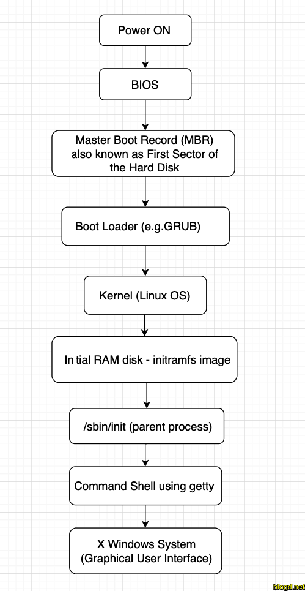
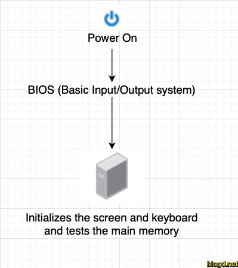
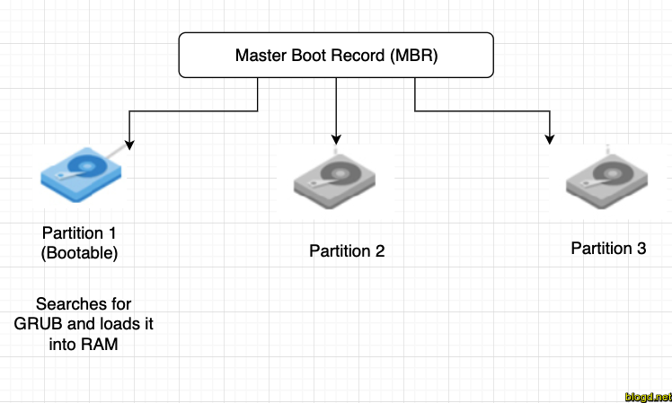
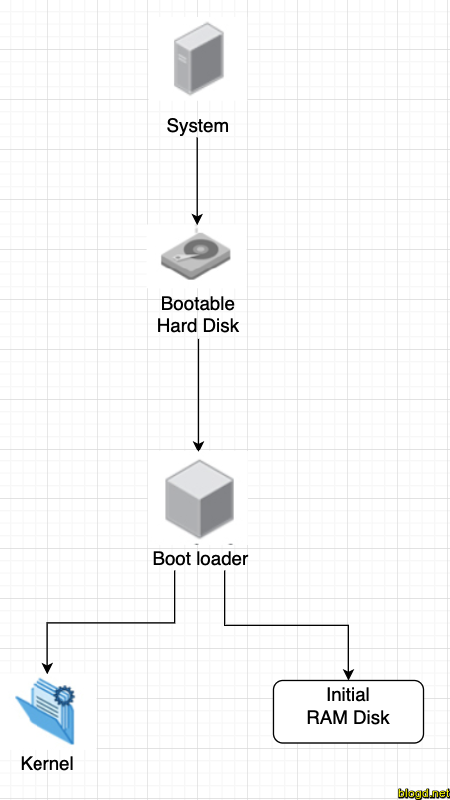
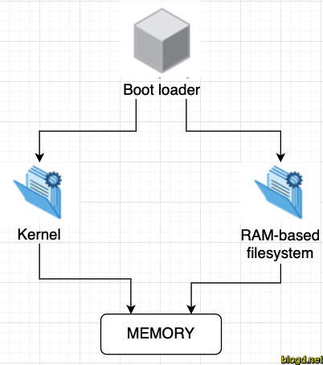
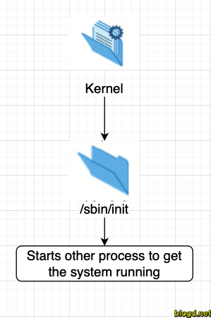
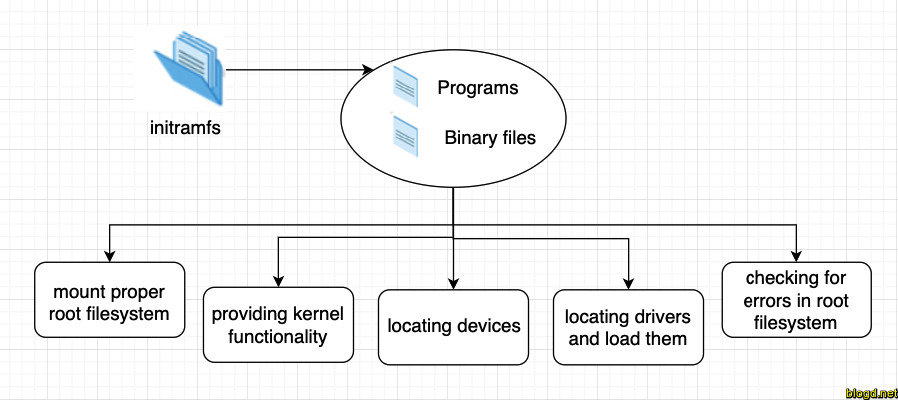

## Linux Boot Process

### Stage 1: BIOS (Basic Input/Output System)
BIOS là chương trình chạy đầu tiên khi nhấn nút nguồn hoặc nút reset trên máy 
BIOS thực hiện một công việc gọi là POST ( Power-on Self-test) kiểm tra các thông số của các phần cứng của máy tính. Ngoài ra , BIOS cho phép thay đổi các thiết lập, cấu hình của nó.
BIOS được lưu trữ trên ROM của bo mạch chủ.
Quá trình POST kết thúc thành công, BIOS sẽ tìm kiếm và khởi chạy một hệ điều hành được chứa trong các thiết bị lưu trữ như ổ cứng…
Hệ điều hành Linux được cài trên ổ cứng thì BIOS sẽ tìm đến MBR (Master Boot Record)

### Stage 2: MBR (Master Boot Record)
Sau khi BIOS xác định được thiết bị lưu trữ thì BIOS sẽ đọc trong MBR hoặc phân vùng EFI của thiết bị này để nạp vào bộ nhớ một chương trình. Chương trình này sẽ định vị và khởi động boot loader – đây là chương trình chịu trách nhiệm cho việc tìm và nạp Kernel cho OS.
Đến giai đoạn này, máy tính sẽ không truy cập vào phương tiện lưu trữ nào. Thông tin về ngày tháng, thời gian và các thiết bị ngoại vi quan trọng nhất được nạp từ CMOS.

### Stage 3: GRUB (Grand Unified Bootloader)
Linux có 2 boot loader phổ biến trên Linux là GRUB và ISOLINUX.
Chương trình này có mục đích: cho phép lựa chọn hệ điều hành có trên máy tính để khởi động, sau đó chúng sẽ nạp kernel của hệ điều hành đó vào bộ nhớ và chuyển quyền điều khiển máy tính cho kernel này.
Hệ thống sử dụng phương pháp BIOS/MBR, bộ tải khởi động nằm ở khu vực đầu tiên của đĩa cứng. Kích thước của MBR chỉ là 512 byte. Trong giai đoạn này, bộ nạp khởi động kiểm tra bảng phân vùng và tìm một phân vùng có khả năng khởi động. Nó tìm thấy một phân vùng có khả năng khởi động, nó sẽ tìm kiếm bộ tải khởi động giai đoạn thứ hai.
Với hệ thống sử dụng phương pháp EFI / UEFI, phần mềm UEFI đọc dữ liệu trình quản lý khởi động để xác định ứng dụng UEFI nào sẽ được khởi chạy và từ nơi nào.
Trình khởi động giai đoạn 2 nằm trong /boot. Màng hình hiển thị cho chúng ta chọn hệ điều hành để khởi động. Tiếp đến bộ nạp khởi động sẽ tải hệ điều hành vào RAM và chuyển quyền kiểm soát cho RAM.

### Stage 4: Linux Kernel (Core)
Boot loader nạp một phiên bản dạng nén của Linux kernel. Nó tự giải nén và tự cài đặt lên bộ nhớ hệ thống nơi mà nó sẽ ở đó cho tới khi tắt máy.

Sau khi chọn kernel trong file cấu hình của boot loader, hệ thống sẽ tự động nạp chương trình init trong thư mục /sbin.

### Stage 5: Initrd
INITRD cung cấp một giải pháp: là một tập các chương trình sẽ được thực thi khi kernel vừa mới được khởi chạy. Các chương trình này sẽ dò quét phần cứng của hệ thống và xác định xem kernel cần được hỗ trợ thêm những gì để có thể quản lý được các phần cứng đó. Chương trình INITRD có thể nạp thêm vào kernel các module bổ trợ. Khi chương trình INITRD kết thúc thì quá trình khởi động Linux sẽ tiếp diễn.

Hệ thống hình ảnh tập tin initramfs chứa các chương trình và tệp nhị phân thực hiện các hành động cần thiết để gắn kết hệ thống tệp gốc thích hợp, cung cấp chức năng hạt nhân cho hệ thống tệp và trình điều khiển thiết bị cần thiết cho bộ điều khiển lưu trữ hàng loạt với cơ sở được gọi là udev (cho thiết bị người dùng). Thiết bị nào có mặt, định vị các trình điều khiển thiết bị mà chúng cần để hoạt động chính xác và tải chúng. Sau khi hệ thống tập tin gốc đã được tìm thấy, nó được kiểm tra lỗi và được gắn kết.
### Stage 6: Runlevel Programs
Kernel được khởi chạy xong, nó sẽ gọi duy nhất một chương trình tên là init.
Tiến trình này có ID = 1 Init là cha của tất cả các tiến trình khác mà có trên hệ thống Linux.
Init xử lý việc gắn và xoay vòng vào hệ thống tập tin gốc thực sự cuối cùng.
Trong hệ điều hành Linux có 2 loại init phổ biến:
- Loại thứ nhất dựa trên Unix System V
- Loại thứ hai dựa trên Systemd

**Unix System V**
*File cấu hình run level /etc/inittab:*
Runlevel 0: Level Shutdown hệ thống.
Runlevel 1: Level chỉ dùng cho 1 người dùng để sửa lỗi hệ thống tập tin.
Runlevel 2: Không sử dụng.
Runlevel 3: Level dùng cho nhiều người dùng nhưng chỉ giao tiếp dạng text (không có giao diện).
Runlevel 4: Không sử dụng.
Runlevel 5: Level dùng cho nhiều người dùng và được cung cấp giao diện đồ họa.
Runlevel 6: Level Reboot hệ thống.
Sau khi xác định run level. Chương trình /sbin/init sẽ thực thi các file statup script được đặt trong các thư mục con của thư mục /etc/rc.d.
