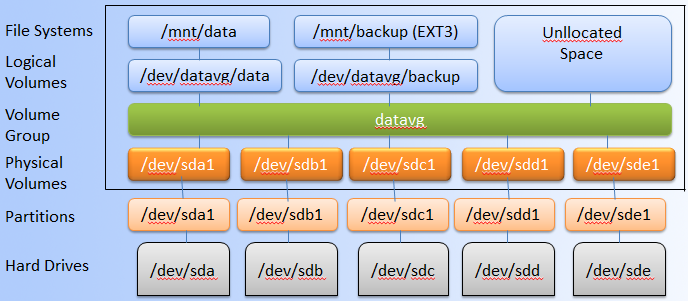
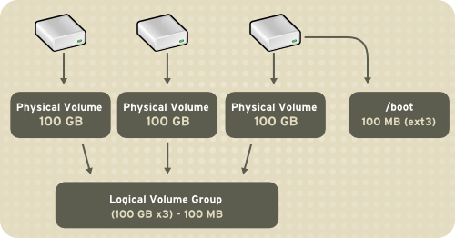
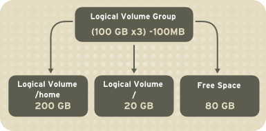

### 1. LVM (Logical Volume Manager)

LVM là công cụ quản lý các phân vùng Logic được tạo và phân bổ từ các ổ đĩa. LVM có thể linh hoạt trong việc resize, xoá phân vùng đã tạo.
Mục đích sử dụng :
- Tạo 1 hoặc nhiều phần vùng logic hoặc phân vùng với toàn bộ đĩa cứng cho phép thay đổi kích thước volume.
- Quản lý (Large hard Disk Farms) bằng cách cho phép thêm và thay thế đĩa mà không bị ngừng hoạt động hoặc gián đoạn dịch vụ, kết hợp với trao đổi nóng (hot swapping).
- Trên các hệ thống nhỏ (desktop), thay vì phải ước tính thời gian cài đặt, phân vùng có thể cần lớn đến mức nào, LVM cho phép các hệ thống tệp dễ dàng thay đổi kích thước khi cần.
- Thực hiện sao lưu nhất quán bằng cách tạo snapshot nhanh các block.
- Cho phép mã hoá nhiều phân vùng bằng một password.

### 2. Kiến trúc LVM

#### 2.1. Physical Volume 
Được tạo từ các phân vùng trên ổ đĩa cứng.
#### 2.2. Volume Group 
Là nhóm các Physical Volume từ 1 hoặc nhiều Disk khác nhau hợp lại.

#### 2.3 Logical Volume
Một Volume Group được chia nhỏ thành nhiều Logical Volume. Nó được dùng cho các để mount tới hệ thống tập tin (File System) và được format với những chuẩn định dạng khác nhau như ext2, ext3, ext4…

#### 2.4. File Systems
Hệ thống tập tin quản lý các file và thư mục trên ổ đĩa, được mount tới các Logical Volume trong mô hình LVM

### 3. Tạo vào quản lý Logical Volume Manager trên Centos 7
#### 3.1. Tạo physical Volume
- Cần có sẵn các partition để tạo được physical volume
```
$ pvcreate /dev/sdb1
Physical volume "/dev/sdb1" successfully created
```
#### 3.2. Tạo volume group
- Cần có các physical volume trước khi tạo volume group
```
$ vgcreate mysql_vg /dev/sdb1
Volume group "mysql_vg" successfully created
```
#### 3.3. Tạo Logical Volume
```
$ lvcreate -L 3G -n mysql_lv mysql_vg
Logical volume "mysql_lv" created.
```
#### 3.4. Tạo file system format ext4 cho Logical Volume
```
$ mkfs.ext4 /dev/mysql_vg/mysql_lv
```
#### 3.5. Mount Logical Volume
```
$ mkdir /mysql
$ mount /dev/mysql_vg/mysql_lv /mysql
```
### 4. Quản lý Logical Volume Manager
#### 4.1. Tăng và giảm kích thước Logical Volume
VD Tăng kích thước Logical Volume lên thêm 40GB
```
$ lvextend -L +40G /dev/mysql_vg/mysql_lv
$ resize2fs /dev/mysql_vg/mysql_lv
```
#### 4.2. Xóa Logical Volume
```
$ umount /dev/mysql_vg/mysql_lv
$ lvremove /dev/mysql_vg/mysql_lv
```
#### 4.3. Xoá Logical Volume Group
```
$ vgremove /dev/mysql_vg
```
#### 4.4. Xóa Physical Volume 
```
$ pvremove /dev/sd
```