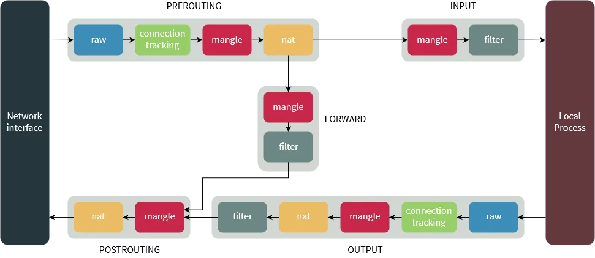

### 1. Iptable là gì?
Linux Kernel cung cấp 1 package filter framework là netfilter. Iptable được xây dựng dựa trên tính năng netfilter, cung cấp một firewall mạnh mẽ, với việc có thể thêm các rules lọc traffic vào ra trên hệ thống. Thêm vào fail2ban là một chương trình mạnh mẽ để block những attackers.

### 2. Iptable hoạt động thế nào?
Iptable cung cấp cơ chế lọc các gói tin với 3 cấu trúc khác nhau: **tables**, **chain**, **targets**.
Table là thành phần cho phép xử lý các gói tin, table có 4 loại khác nhau, table mặc định trong Iptable là filter.
Các **Chain** được gắn vào table. Chain cho phép kiểm tra traffic ở những điểm khác nhau.
Khi một gói tin đến, Iptables sẽ đối chiếu với các rule trong chain. Khi khớp, nó đưa vào **target** để thực hiện liên kết chúng. Nếu không khớp với bất kỳ rule nào, nó sẽ thực hiện theo default policy của **chain**. Default policy cũng là 1 target, mặc định tất các các default policy này sẽ là cho phép gói tin đi qua.

#### 2.1. Tables
Có 4 tables phổ biến trên Linux:
- filter: là table mặc định và được sử dụng phổ biến. Được sử dụng để quyết định xem gói tin có được cho phép đến đích không.
- mangle: đây là table cho phép thay đổi phần header của gói tin (packet), VD: thay đổi giá trị TTL (Time to live)
- nat: table này cho phép định tuyến gói tin tới những host khác nhau trong mạng NAT, bằng việc thay đổi địa chỉ nguồn và đích của gói tin. Nó thường được sử dụng để cho phép truy cập các dịch vụ gián tiếp.
- raw: các gói tin trong iptable được kiểm tra theo trạng thái (state). raw table cho phép làm việc với các gói trước khi kernel theo dõi trạng thái của nó.
#### 2.2. Chains
Chain cho phép lọc gói tin ở nhiều điểm.
- PREROUTING: Rule áp dụng cho các gói đến từ network interface. Có trong table nat, magle, raw.
- INPUT: Rule áp dụng với các gói trước khi tới local process. Có trong các table magle và filter.
- OUTPUT: Rule áp dụng với các gói chỉ sau khi chúng được tạo bởi một process trong local process. Có trong tất các các table.
- FORWARD: Rule áp dụng cho bất kỳ gói nào được định tuyến trên host hiện tại. Có trong các tbale là mangle và filter.
- POSTROUTING: RUle này áp dụng cho gói khi đi ra Network Interface. Có trong các table nat và mangle.

