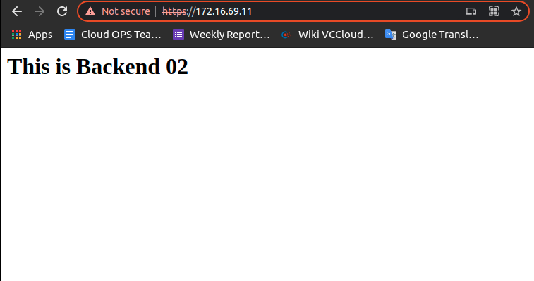

# 1.LAB1

## 1.1.Mô hình


- Client, Server cài hệ điều hành Ubuntu Server 16.04.
- Cấu hình iptables tại Server.

## 1.2.Mục đích

- Mặc định, DROP INPUT.
- Mặc định, ACCEPT OUTPUT.
- Mặc định, DROP FORWARD.
- ACCEPT Established Connection.
- ACCEPT kết nối từ loopback.
- ACCEPT kết nối Ping với 5 lần mỗi phút từ mạng LAN.
- ACCEPT kết nối SSH từ trong mạng LAN.

## 1.3.Cấu hình
- Tạo default rule`````````` DROP INPUT, ACCEPT OUTPUT và DROP FORWARD
```
iptables -P INPUT DROP
iptables -P OUTPUT ACCEPT
iptables -P FORWARD DROP
```
```
root@virsh02:~# iptables -S
-P INPUT DROP
-P FORWARD DROP
-P OUTPUT ACCEPT
```
- Tạo Rule ACCEPT Established Connection.
```
iptables -A INPUT -p tcp -m state --state ESTABLISHED -j ACCEPT
iptables -A INPUT -p udp -m state --state ESTABLISHED -j ACCEPT
```
- Tạo rule ACCEPT kết nối từ card loopback:
```
iptables -A INPUT -s 127.0.0.1 -d 127.0.0.1 -j ACCEPT
```
- Tạo rule ACCEPT kết nối Ping với 5 lần mỗi phút từ mạng LAN.
```
iptables -A INPUT -p icmp --icmp-type echo-request -m limit --limit 5/m --limit-burst 5 -m state --state NEW,ESTABLISHED -s 172.16.69.0/24 -d 172.16.69.11 -j ACCEPT
```
- Tạo rule ACCEPT SSH 
```
iptables -A INPUT -p tcp -m state --state NEW -s 172.16.69.0/24 -d 172.16.69.11 --dport 22 -j ACCEPT
```

# 2.LAB 2

## 2.1.Mô hình


- Client, Server cài hệ điều hành Ubuntu Server 16.04.
- Cấu hình iptables tại Server.

## 2.2.Mục đích
- Mặc định, DROP INPUT.
- Mặc định, ACCEPT OUTPUT.
- Mặc định, DROP FORWARD.
- ACCEPT Established Connection.
- ACCEPT kết nối từ loopback.
- ACCEPT kết nối Ping với 5 lần mỗi phút từ mạng LAN.
- ACCEPT kết nối SSH từ trong mạng LAN.
- ACCEPT Outgoing gói tin thông qua Server từ mạng LAN (10.10.10.0/24) và nat địa chỉ nguồn của gói tin.\

## 2.3.Cấu hình

**Trên Server**
Kích hoạt iptables fordward packet, cần sửa file /etc/sysctl.conf:

```
net.ipv4.ip_forward = 1
```
Chạy lệnh `sysctl -p /etc/sysctl.conf` để kiểm tra cài đặt.
- Sau đó:

```
/etc/init.d/procps restart
```
- DROP INPUT, ACCEPT OUTPUT và DROP FORWARD:

```
iptables -P INPUT DROP
iptables -P OUTPUT ACCEPT
iptables -P FORWARD DROP
```
- ACCEPT Established Connection.

```
iptables -A FORWARD -m state --state ESTABLISHED,RELATED -j ACCEPT
iptables -A INPUT -m state --state ESTABLISHED,RELATED -j ACCEPT
```
- ACCEPT kết nối từ loopback:

```
iptables -A INPUT -s 127.0.0.1 -d 127.0.0.1 -j ACCEPT
```
- ACCEPT kết nối Ping với 5 lần mỗi phút từ mạng LAN.

```
iptables -A INPUT -p icmp --icmp-type echo-request -m limit --limit 5/m --limit-burst 5 \
	-s 10.10.10.0/24 -d 10.10.10.11 -j ACCEPT
```
- ACCEPT kết nối SSH từ trong mạng LAN:

```
iptables -A INPUT -p tcp -s 10.10.10.0/24 -d 10.10.10.11 --dport 22 -m state --state NEW -j ACCEPT
```

- ACCEPT Outgoing gói tin qua Server từ network (10.10.10.0/24) và nat địa chỉ nguồn của gói tin.

```
iptables -A FORWARD -i ens38 -o ens33 -j ACCEPT
iptables -t nat -A POSTROUTING -o ens33 -s 10.10.10.0/24 -j SNAT --to-source 10.10.10.11
```
hoặc

```
iptables -A FORWARD -i ens38 -o ens33 -j ACCEPT
iptables -t nat -A POSTROUTING -o ens33 -s 10.10.10.0/24 -j MASQUERADE
```

# 3.LAB 3

## 3.1.Mô hình


- Client, Server cài hệ điều hành Ubuntu Server 16.04.
- Cấu hình iptables tại Server.
- Trên Backend1, cài Web server (apache2) lắng nghê trên port 80.
- Trên Backend2, cài Web server (apache2) lắng nghê trên port 443.

## 3.2.Mục đích

- Mặc định, DROP INPUT.
- Mặc định, ACCEPT OUTPUT.
- Mặc định, DROP FORWARD.
- ACCEPT Established Connection.
- ACCEPT kết nối từ loopback.
- FORWARD gói tin đến port 80 trên ens33 đến port tương tự trên Backend1.
- FORWARD gói tin đến port 443 trên ens33 đến port tương tự trên Backend2.
- Nhưng DROP gói tin từ 172.16.69.2.
- ACCEPT kết nối Ping với 5 lần mỗi phút từ mạng LAN.
- ACCEPT kết nối SSH từ trong mạng LAN
- Nhưng DROP gói tin từ 10.10.10.101.
- ACCEPT Outgoing Packets thông qua Server từ mạng LAN (10.10.10.0/24) và nat địa chỉ nguồn của packet.

## 3.3.Cấu hình

- Đặt IP Tĩnh cho client, backend01 và 02 trỏ về gateway 10.10.10.11

## a, Trên Backend1
- Cấu hình IP như mô hình, gateway là 10.10.10.11.
- Cài đặt apache2:

```
# apt install apache2
```
- Sửa nôi dụng file /var/www/html/index.html như sau:

```
<h1>This is Backend1</h1>
```

## b, Trên Backend2
- Cấu hình IP như mô hình, gateway là 10.10.10.11.
- Cài đặt apache2:

```
# apt install apache2
```
- Sửa nôi dụng file `/var/www/html/index.html` như sau:

```
<h1>This is Backend2</h1>
```
- Kích hoạt ssl:

```
a2enmod ssl
a2ensite default-ssl.conf
systemctl restart apache2
```

## c, Trên Server
- Kích hoạt iptables fordward packet sang máy khác sửa file /etc/sysctl.conf:
```
net.ipv4.ip_forward = 1
```

Chạy lệnh `sysctl -p /etc/sysctl.conf` để kiểm tra cài đặt.

- Sau đó:

```
/etc/init.d/procps restart
```
- ACCEPT SSH && DROP FROM CLIENT

```
iptables -A INPUT -p tcp -s 10.10.10.0/24 -d 10.10.10.11 --dport 22 -m state --state NEW -j ACCEPT
iptables -A INPUT -s 10.10.10.101 -j DROP
```
- ACCEPT Established Connection.
```
iptables -A FORWARD -m state --state ESTABLISHED,RELATED -j ACCEPT
iptables -A INPUT -m state --state ESTABLISHED,RELATED -j ACCEPT
```
- Accept loopback
```
iptables -A INPUT -s 127.0.0.1 -d 127.0.0.1 -j ACCEPT
```

- Tao chain default DROP INPUT, ACCEPT OUTPUT, DROP FORWARD.
```
iptables -P INPUT DROP
iptables -P OUTPUT ACCEPT
iptables -P FORWARD DROP
```
- Accept PING from 10.10.10.0
```
iptables -A INPUT -p icmp --icmp-type echo-request -m limit --limit 5/m --limit-burst 5 \
	-s 10.10.10.0/24 -d 10.10.10.11 -j ACCEPT
```
- Accept forward package ens38 --> ens33 port 80,443
```
iptables -A FORWARD -p tcp --dst 10.10.10.51 --dport 80 -j ACCEPT
iptables -A FORWARD -p tcp --dst 10.10.10.52 --dport 443 -j ACCEPT
```
- Rule DNAT ens33 --> ens38
```
iptables -t nat -A PREROUTING -i ens33 -p tcp -d 172.16.69.11 --dport 80 \
	-j DNAT --to-destination 10.10.10.51:80
iptables -t nat -A PREROUTING -i ens33 -p tcp -d 172.16.69.11 --dport 443 \
	-j DNAT --to-destination 10.10.10.52:443
```
- Rule SNAT ens38 --> ens33

```
iptables -A FORWARD -i ens38 -o ens33 -j ACCEPT
iptables -t nat -A POSTROUTING --out-interface ens38 -j MASQUERADE
```

## d, Test Kq
- Truy cập vào http://172.16.69.11 


- Truy cập vào https://172.16.69.11



- Tren client
```
root@client:~# ping 10.10.10.11
PING 10.10.10.11 (10.10.10.11) 56(84) bytes of data.

--- 10.10.10.11 ping statistics ---
14 packets transmitted, 0 received, 100% packet loss, time 13103ms
```

## f, Save rule permanent

```
/sbin/iptables-save > /etc/iptables/rules.v4	
```

# 4.LAB 

## 4.1.Mô hình


- Client, Server cài hệ điều hành Ubuntu Server 16.04.
- Router, có thể giả lập là VM.
- Cấu hình iptables tại Server.
- Trên Backend1, cài Web server (apache2) lắng nghê trên port 80.
- Trên Backend2, cài Web server (apache2) lắng nghê trên port 443.

## 4.2.Mục đích

- Mặc định, DROP INPUT.
- Mặc định, ACCEPT OUTPUT.
- Mặc định, DROP FORWARD.
- ACCEPT Established Connection.
- ACCEPT kết nối từ loopback.
- FORWARD gói tin đến port 80 trên ens33 đến port tương tự trên Backend1.
- FORWARD gói tin đến port 443 trên ens33 đến port tương tự trên Backend2.
- Nhưng DROP gói tin từ 172.16.69.2.
- ACCEPT kết nối Ping với 5 lần mỗi phút từ mạng LAN.
- ACCEPT kết nối SSH từ trong mạng LAN
- Nhưng DROP gói tin từ 10.10.10.101.
- ACCEPT Outgoing Packets thông qua Server từ mạng LAN (10.10.10.0/24) và nat địa chỉ nguồn của packet.

## 4.3.Cấu hình

- Đặt IP Tĩnh cho client, backend01 và 02 trỏ về gateway 10.10.10.11

## a, Trên Backend1
- Cấu hình IP như mô hình, gateway là 10.10.10.11.
- Cài đặt apache2:

```
# apt install openssh-server
```
- Sửa nôi dụng file /var/www/html/index.html như sau:

```
<h1>This is Backend1</h1>
```

## b, Trên Backend2
- Cấu hình IP như mô hình, gateway là 10.10.10.11.
- Cài đặt apache2:

```
# apt install apache2
```
- Sửa nôi dụng file `/var/www/html/index.html` như sau:

```
<h1>This is Backend2</h1>
```
- Kích hoạt ssl:

```
a2enmod ssl
a2ensite default-ssl.conf
systemctl restart apache2
```

## c, Trên Server
- Kích hoạt iptables fordward packet sang máy khác sửa file /etc/sysctl.conf:
```
net.ipv4.ip_forward = 1
```

Chạy lệnh `sysctl -p /etc/sysctl.conf` để kiểm tra cài đặt.

- Sau đó:

```
/etc/init.d/procps restart
```
- ACCEPT SSH && DROP FROM CLIENT

```
iptables -A INPUT -p tcp -s 10.10.10.0/24 -d 10.10.10.11 --dport 22 -m state --state NEW -j ACCEPT
```
- ACCEPT Established Connection.
```
iptables -A FORWARD -m state --state ESTABLISHED,RELATED -j ACCEPT
iptables -A INPUT -m state --state ESTABLISHED,RELATED -j ACCEPT
```
- Accept loopback
```
iptables -A INPUT -s 127.0.0.1 -d 127.0.0.1 -j ACCEPT
```

- Tao chain default DROP INPUT, ACCEPT OUTPUT, DROP FORWARD.
```
iptables -P INPUT DROP
iptables -P OUTPUT ACCEPT
iptables -P FORWARD DROP
```
- Accept PING from network 10.10.10.0
```
iptables -A INPUT -p icmp --icmp-type echo-request -m limit --limit 5/m --limit-burst 5 \
	-s 10.10.10.0/24 -d 10.10.10.11 -j ACCEPT
```
- Forward package ens38 --> ens33 port 80,22
```
iptables -A FORWARD -p tcp -d 10.10.10.51 --dport 22 -j ACCEPT
iptables -A FORWARD -p tcp -d 10.10.10.52 --dport 80 -j ACCEPT
iptables -A FORWARD -i ens38 -o ens33 -j ACCEPT
```
- Rule DNAT ens33 --> ens38 port 80,22
```
iptables -t nat -A PREROUTING -p tcp -d 172.16.69.11 --dport 22 \
	-j DNAT --to-destination 10.10.10.51
iptables -t nat -A PREROUTING -p tcp -d 172.16.69.11 --dport 80 \
	-j DNAT --to-destination 10.10.10.52
```
- Rule SNAT ens38 --> ens33 port 80,22

```
iptables -t nat -A POSTROUTING -p tcp -d 10.10.10.51 --dport 22 \
	-j SNAT --to-source 10.10.10.11
iptables -t nat -A POSTROUTING -p tcp -d 10.10.10.52 --dport 80 \
	-j SNAT --to-source 10.10.10.11
```

## d, Test Kq
- Truy cập vào http://172.16.69.11 


- SSH vào Backend_01
```
namdp@vccpc:~/.ssh$ ssh root@172.16.69.11
The authenticity of host '172.16.69.11 (172.16.69.11)' can't be established.
ECDSA key fingerprint is SHA256:bA06ngqN7lV/2l2nDgvW3LhLvr+JcxxFv+hu1/g+9mI.
Are you sure you want to continue connecting (yes/no/[fingerprint])? yes
Warning: Permanently added '172.16.69.11' (ECDSA) to the list of known hosts.
Welcome to Ubuntu 16.04.7 LTS (GNU/Linux 4.4.0-186-generic x86_64)

 * Documentation:  https://help.ubuntu.com
 * Management:     https://landscape.canonical.com
 * Support:        https://ubuntu.com/advantage


111 packages can be updated.
80 updates are security updates.


Last login: Fri Jul 16 14:04:56 2021 from 10.10.10.1
root@backend_01:~#
```

## f, Save rule permanent

```
/sbin/iptables-save > /etc/iptables/rules.v4	
```

# 5.LAB5
## 5.1.Mô hình


- Client1, Client2, WebServer và Firewall cài hệ điều hành Ubuntu Server 16.04.
- Cấu hình iptables tại Firewall.
- Trên WebServer, cài Web server (apache2) lắng nghê trên port 80.

## 5.2.Mục đích

- Mặc định, DROP INPUT.
- Mặc định, ACCEPT OUTPUT.
- Mặc định, DROP FORWARD.
- ACCEPT Established Connection.
- FORWARD gói tin đến port 80 trên ens33 sang port ens38 và đến port 80 trên Webserver.
- Cho phép 1 máy (Client1) trong dải 10.10.20.0/24 quản trị Webserver.
- Cho phép các máy trong dải 10.10.20.0/24 kết nối ra Internet.

## 5.3.Cấu hình

- ACCEPT Established Connection.
```
iptables -A FORWARD -m state --state ESTABLISHED,RELATED -j ACCEPT
iptables -A INPUT -m state --state ESTABLISHED,RELATED -j ACCEPT
```

- Tao chain default DROP INPUT, ACCEPT OUTPUT, DROP FORWARD.
```
iptables -P INPUT DROP
iptables -P OUTPUT ACCEPT
iptables -P FORWARD DROP
```
- FORWARD gói tin đến port 80 trên ens33 sang port ens38 và đến port 80 trên Webserver.

```
iptables -A FORWARD -i ens33 -o ens38 -p tcp -d 10.10.10.51 --dport 80 -j ACCEPT
iptables -t nat -A PREROUTING -i ens33 -p tcp -d 172.16.69.11 --dport 80 \
	-j DNAT --to-destination 10.10.10.51
iptables -t nat -A POSTROUTING -o ens38 -p tcp -d 10.10.10.51 --dport 80 \
	-j SNAT --to-source 10.10.10.11
```
- Cho phép 1 máy (Client1) trong dải 10.10.20.0/24 quản trị Webserver.
```
iptables -A FORWARD -m state --state NEW -i ens39 -o ens38 -p tcp -s 10.10.20.101 -d 10.10.10.51 \
	--dport 22 -j ACCEPT
```
- Cho phép các máy trong dải 10.10.20.0/24 kết nối ra Internet.
```
iptables -A FORWARD -m state --state NEW -i ens39 -o ens33 -j ACCEPT
iptables -t nat -A POSTROUTING -o ens33 -s 10.10.20.0/24 \
	-j SNAT --to-source 172.16.69.11
```

## Test
- Check client ping dc den dai mang internet
```
root@client01:~# ping 172.16.69.1
PING 172.16.69.1 (172.16.69.1) 56(84) bytes of data.
64 bytes from 172.16.69.1: icmp_seq=1 ttl=63 time=1.17 ms
64 bytes from 172.16.69.1: icmp_seq=2 ttl=63 time=1.15 ms
64 bytes from 172.16.69.1: icmp_seq=3 ttl=63 time=1.11 ms
64 bytes from 172.16.69.1: icmp_seq=4 ttl=63 time=1.13 ms
^C
--- 172.16.69.1 ping statistics ---
4 packets transmitted, 4 received, 0% packet loss, time 3005ms
rtt min/avg/max/mdev = 1.116/1.145/1.172/0.021 ms
```
