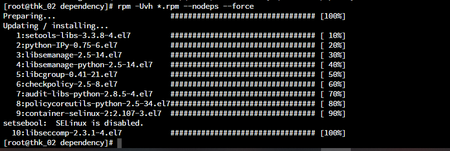
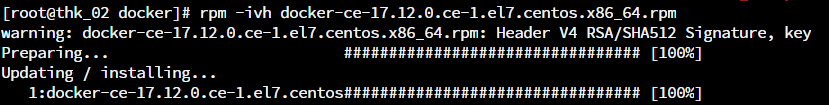
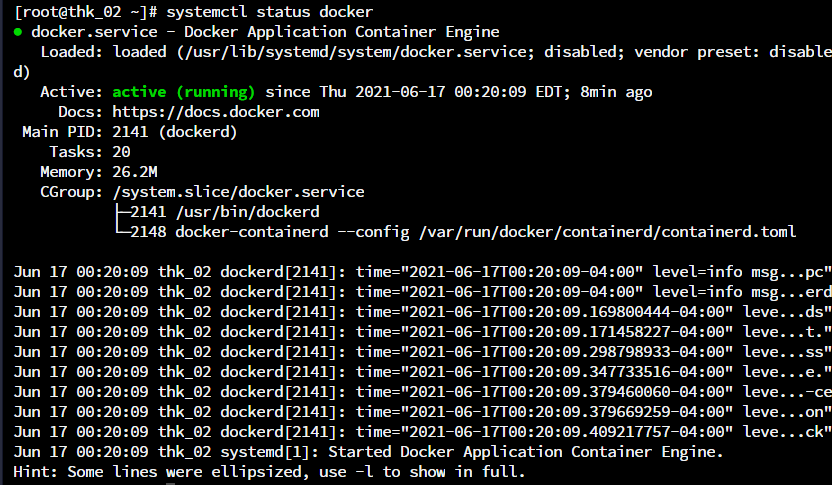
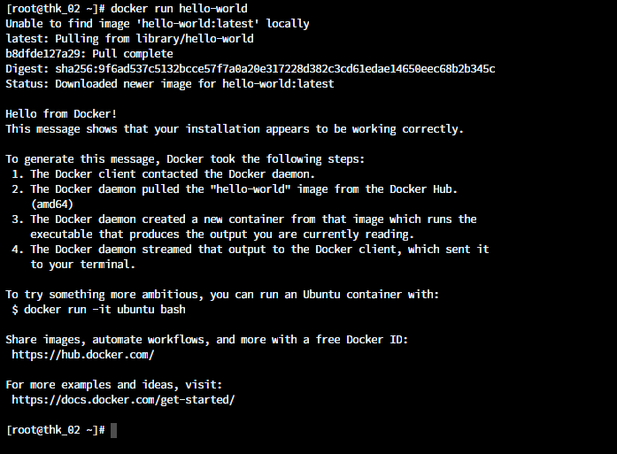

Hướng dẫn cài đặt Docker trên Centos 7 từ Source
### 1. Tải xuống gói rpm cho docker để cài đặt trên Centos 7
Link: https://download.docker.com/linux/centos/7/x86_64/stable/Packages/docker-ce-17.12.0.ce-1.el7.centos.x86_64.rpm
### 2.Tạo thư mục và copy file vừa tải: /opt/docker
### 3. Tải xuống các lib, gói phụ thuộc (dependencies) của Docker 
Link: 
http://mirrors.163.com/centos/7/os/x86_64/Packages/audit-libs-python-2.8.5-4.el7.x86_64.rpm
http://mirrors.163.com/centos/7/os/x86_64/Packages/checkpolicy-2.5-8.el7.x86_64.rpm
http://mirrors.163.com/centos/7/os/x86_64/Packages/libcgroup-0.41-21.el7.x86_64.rpm
http://mirrors.163.com/centos/7/os/x86_64/Packages/libseccomp-2.3.1-4.el7.x86_64.rpm
http://mirrors.163.com/centos/7/os/x86_64/Packages/libsemanage-2.5-14.el7.x86_64.rpm
http://mirrors.163.com/centos/7/os/x86_64/Packages/policycoreutils-python-2.5-34.el7.x86_64.rpm
http://mirrors.163.com/centos/7/os/x86_64/Packages/python-IPy-0.75-6.el7.noarch.rpm
http://mirrors.163.com/centos/7/os/x86_64/Packages/setools-libs-3.3.8-4.el7.x86_64.rpm
http://mirror.centos.org/centos/7/extras/x86_64/Packages/container-selinux-2.107-3.el7.noarch.rpm
http://mirror.centos.org/centos/7/os/x86_64/Packages/libsemanage-python-2.5-14.el7.x86_64.rpm
### 4.Tạo thư mục và copy các file vừa tải: /opt/docker/dependency 
### 5. Thực hiện cài đặt Docker
- Cài đặt các dependency tại folder /opt/docker/dependency :
```
# rpm -Uvh *.rpm --nodeps --force
```

- Cài đặt docker  tại folder /opt/docker :
```
# rpm -ivh docker-ce-17.12.0.ce-1.el7.centos.x86_64.rpm
```

- Khởi động docker service và kiểm tra trạng thái:
```
# systemctl start docker
# systemctl status docker
```

- Chạy thử container
```
# docker run hello-world
```

