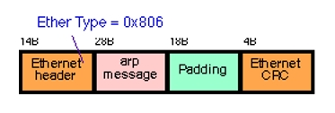
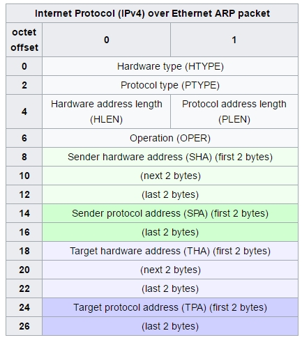
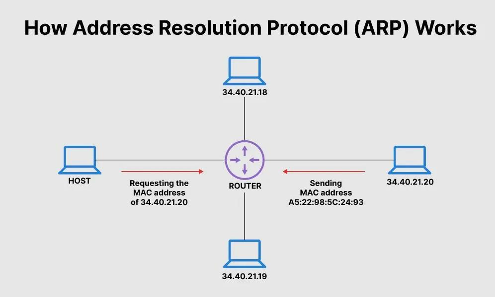
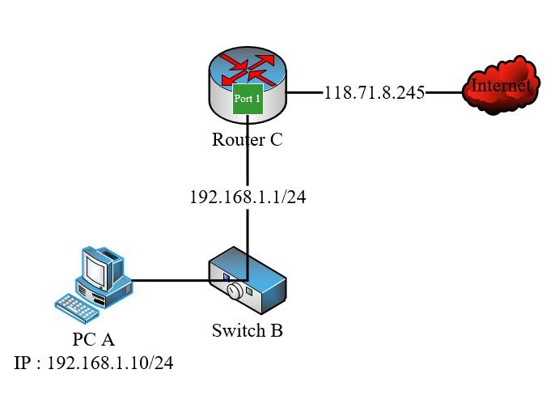

## 1. Khái niệm ARP
- ARP ( Address resolution prrotocol ) là protocol dùng để kết nối IP Address tới Mac Address, hoạt động ở tầng Network trong mồ hình OSI. Nó dịch địa chỉ IP 32bit thành địa chỉ MAC 48bit 
## 2. ARP hoạt động thế nào?

- Khi một ccomputer join vào mạng LAN sẽ được cấp một địa chỉ IP duy nhất để định danh trong mạng và giao tiếp với các thiết bị khác. 
- Khi device cần biết MAC address của device khác nó gửi một gói tin quảng bá (broadcast) ARP Request bao gồm MAC Address và IP của device cần request MAC address. 
- Tất cả device trên toàn mạng nhận được gói tin quảng bá và so sánh với IP của chính nó nếu match nó sẽ response cho device request một packet gồm MAC Address.

## 3. Package Structure 
### 3.1.Cấu trúc của ARP packet
- Gồm có 4 thành phần 
  - Ethernet header
  - ARP Message
  - Padding 
  - Ethernet CRC



### 3.2.Cấu trúc của ARP message



**Các thành phần có trong ARP Message**
- **Hardware type (HTYPE) :** Trường này cho biết network protocol . Example : Ethernet là “1” .
- **Protocol type ( PTYPE ) :** Trường này cho biết internetwork protocol . Example : IPv4 là “0x0800”
- **Hardware length ( HLEN ) :** Độ dài ( octets) của hardware address . Ethernet address có độ dài là 6 octets .
- **Protocol length ( PLEN ) :** Độ dài của internetwork address được sử dụng . IPv4 address có độ dài là 4 octets .
- **Operation** : Cho biết packet là “ARP request” hay “ARP reply” . “ARP request” là “1” và “ARP reply” là “2” .
- **Sender hardware address (SHA)** : MAC address của sender .
- **Sender protocol address (SPA)** : Internetwork address (IP) của sender .
- **Target hardware address (THA)** : MAC address của receiver .
- **Target protocol address (TPA)** : Internetwork address (IP) của receiver 

## 4. Example 

### 4.1. Truyền tin giữa các PC trong mạng LAN

-  Mô hình :



Các PC ở hình trên ở trong cùng một mạng LAN 34.40.21.20/24.
Máy host muốn gửi request MAC address tới PC B (IP 30.40.21.20)

**Chi tiết các bước:**

- **Bước 1:** PC HOST sẽ kiểm tra cache của mình . Nếu đã có MAC address của PC B thì PC HOST sẽ gửi packet cho PC B
- **Bước 2:** Nếu trong cache chưa có PC HOST Bắt đầu khởi tạo gói tin ARP Request. Nó sẽ gửi một gói tin broadcast đến toàn bộ các máy khác trong mạng với MAC address và IP máy gửi là địa chỉ của chính nó, địa chỉ IP máy nhận là 30.40.21.20, và MAC address máy nhận là ff:ff:ff:ff:ff:ff.
- **Bước 3:** PC HOST phân phát gói tin ARP Request trên toàn mạng. Khi Router nhận được gói tin broadcast nó sẽ chuyển gói tin này tới tất cả các máy trong mạng LAN đó.
- **Bước 4:** Các PC trong mạng đều nhận được gói tin ARP Request. Chúng kiểm tra trường địa chỉ Target Protocol Address. Nếu trùng với địa chỉ của mình thì tiếp tục xử lý, nếu không thì DROP gói tin.
- **Bước 5:** PC có IP trùng với IP trong trường Target Protocol Address sẽ bắt đầu quá trình khởi tạo gói tin ARP Reply bằng cách: lấy các trường Sender Hardware Address và Sender Protocol Address trong gói tin ARP nhận được đưa vào làm Target trong gói tin gửi đi. Đồng thời thiết bị sẽ lấy địa chỉ MAC của mình để đưa vào trường Sender Hardware Address
- **Bước 6:** PC B đồng thời cập nhật bảng ánh xạ IP address và MAC address của thiết bị nguồn vào bảng ARP cache của mình để giảm bớt thời gian xử lý cho các lần sau .
- **Bước 7:** PC B bắt đầu gửi gói tin Reply đã được khởi tạo đến PC HOST.
- **Bước 8:** PC HOST nhận được gói tin reply và xử lý bằng cách lưu trường Sender Hardware Address trong gói reply vào bảng ARP cache làm MAC address tương ứng với IP address của PC B. Cho các lần giao tiếp sau

### 4.2.Truyền tin trong môi trường Internet mạng WAN



- Với mô hình này sẽ cần 1 Router giúp định tuyến gói tin đi ra ngoài Internet

Chi tiết các bước:

PC A gửi một “ARP request” để tìm MAC address của “Port 1” của Router C .
Router C gửi lại cho PC A một “ARP reply” , cung cấp cho PC A MAC address của Port 1 .
PC A truyền packet đến Port 1 của Router .
Router nhận được packet từ PC A và chuyển packet ra “Port WAN” và truyền ra Internet 

## 5.ARP Caching

### 5.1.Đặt vấn đề

- Trong quá trình tuyển tin trên mạng thì các Device cần sử dụng ARP Protocol để biết được MAC Address của device đích cần đưa gói tin đến.
- Điều này dẫn đến viẹc sẽ tiêu tốn traffic nếu mỗi lần truyền tin các thiết bị đều thực hiện quá trình trên.
- ARP Cache sinh ra để giải quyết vấn đề đó.

### 5.2. ARP Cache 
- ARP Cache là một table chứa thông tin các IP address và MAC address tương ứng . Mỗi network device đều có bảng ARP Cache riêng.
-  Có 2 cách khác theo để ghi vào bảng ARP cache :
  - Static ARP Cache Entries : Đây là cặp hardware/IP address được thêm vào manual . Nó được lưu trữ vĩnh viễn trong bảng ARP cache .
  - Dynamic ARP cache Entries : Đây là cặp hardware/IP address được thêm vào cache bởi phần mềm ( tự động ) , là kết quả của ARP resolution . Chúng được lưu trữ trong bảng ARP cache với time interval nhất định.

- Lệnh show ARP Table
```
namdp@vccpc:~/Documents/training_namdp$ arp -a
? (192.168.18.79) at 44:8a:5b:cd:e6:88 [ether] on eno1
? (192.168.18.69) at d8:cb:8a:c5:0d:1e [ether] on eno1
? (192.168.18.46) at 00:0c:29:04:c7:29 [ether] on eno1
? (192.168.18.42) at 30:9c:23:d7:76:68 [ether] on eno1
? (10.10.10.129) at 00:0c:29:04:c7:3d [ether] on vmnet1
_gateway (192.168.18.1) at ac:1f:6b:2d:f1:74 [ether] on eno1
? (192.168.18.152) at 30:9c:23:05:72:56 [ether] on eno1
? (192.168.18.150) at 38:22:e2:1e:6d:1c [ether] on eno1
? (192.168.18.21) at 00:0c:29:7c:4d:85 [ether] on eno1
? (192.168.18.66) at d8:cb:8a:6f:00:74 [ether] on eno1
? (192.168.18.64) at 30:9c:23:0f:14:f8 [ether] on eno1
? (192.168.18.217) at 30:9c:23:b7:27:9b [ether] on eno1
```