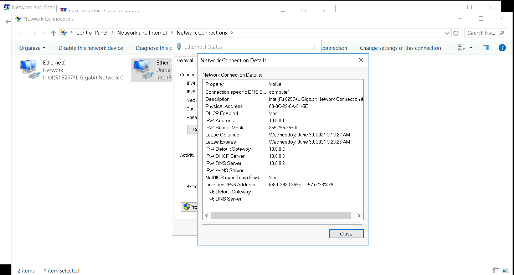

## Cài đặt DHCP Server trên Ubuntu 18.04
### 1. Chuẩn bị môi trường:
- **Server DHCP**: Ubuntu Server 18.04
Network: 10.0.0.0
Static IP Address: 10.0.0.3
Subnet: 255.255.255.0
Gateway: 10.0.0.1
IP Address Pool: 10.0.0.10 - 10.0.0.250
```
3: ens36: <BROADCAST,MULTICAST,UP,LOWER_UP> mtu 1500 qdisc fq_codel state UP group default qlen 1000
    link/ether 00:0c:29:ae:05:75 brd ff:ff:ff:ff:ff:ff
    inet 10.0.0.3/24 brd 10.0.0.255 scope global noprefixroute ens36
       valid_lft forever preferred_lft forever
    inet6 fe80::20c:29ff:feae:575/64 scope link 
       valid_lft forever preferred_lft forever
```
- **Client:** 
Windows Server 2016 & Ubuntu Server 18.04
2 máy Client cần có 1 NIC kết nối với NIC ens36 của Ubuntu Server 
### 2. Cài đặt và cấu hinh DHCP Server 
**Bước 1**:Cài đặt DHCP Server
```
sudo apt update
sudo apt install isc-dhcp-server -y
```
**Bước 2**: Cấu hình DHCP Server
```
vim /etc/dhcp/dhcpd.conf
```
Thêm các dòng sau vào file `dhcpd.conf`
```
option domain-name "compute1";
option domain-name-servers 10.0.0.2;	
default-lease-time 600;
max-lease-time 7200;
ddns-update-style none;
authoritative;
subnet 10.0.0.0 netmask 255.255.255.0 {
  range 10.0.0.10 10.1.1.250;
  option routers 10.0.0.2;
}
```
**Restart DHCP Server** 
```
sudo systemctl restart isc-dhcp-server.service
```
Kiểm tra trạng thái
```
systemctl status isc-dhcp-server.service
● isc-dhcp-server.service - ISC DHCP IPv4 server
   Loaded: loaded (/lib/systemd/system/isc-dhcp-server.service; enabled; vendor preset: enabled)
   Active: active (running) since Wed 2021-06-30 09:19:07 +07; 12min ago
     Docs: man:dhcpd(8)
 Main PID: 27624 (dhcpd)
    Tasks: 1 (limit: 9479)
   CGroup: /system.slice/isc-dhcp-server.service
           └─27624 dhcpd -user dhcpd -group dhcpd -f -4 -pf /run/dhcp-server/dhcpd.pid -cf /etc/dhcp/dhcpd.conf
```
### 3. Client
**Windows Server Client**
Enable Card mạng và kiểm tra IP


**Ubuntu 18.04**
```
3: ens33: <BROADCAST,MULTICAST,UP,LOWER_UP> mtu 1500 qdisc fq_codel state UP group default qlen 1000
    link/ether 00:0c:29:f8:6b:c4 brd ff:ff:ff:ff:ff:ff
    inet 10.0.0.10/24 brd 10.0.0.255 scope global dynamic noprefixroute ens33
       valid_lft 436sec preferred_lft 436sec
    inet6 fe80::20c:29ff:fef8:6bc4/64 scope link
```
**Confirm lại trên DHCP Server bằng lệnh** `dhcp-lease-list`
```
root@compute1:~# !48
dhcp-lease-list
To get manufacturer names please download http://standards.ieee.org/regauth/oui/oui.txt to /usr/local/etc/oui.txt
Reading leases from /var/lib/dhcp/dhcpd.leases
MAC                IP              hostname       valid until         manufacturer        
===============================================================================================
00:0c:29:0a:01:5e  10.0.0.11       WIN-LNOLPE17NJ 2021-06-30 02:29:27 -NA-                
00:0c:29:f8:6b:c4  10.0.0.10       ansible_lab    2021-06-30 02:29:10 -NA- 
```
**Ngoài ra có thể sử dụng DHCP gán Static IP cho Client trong một số trường hợp cần IP tĩnh**
Thêm dòng sau vào file cấu hình `/etc/dhcp/dhcpd.conf`
host ansible_lab {
  hardware ethernet 00:0c:29:f8:6b:c4;
  fixed-address 10.0.0.10;
}
