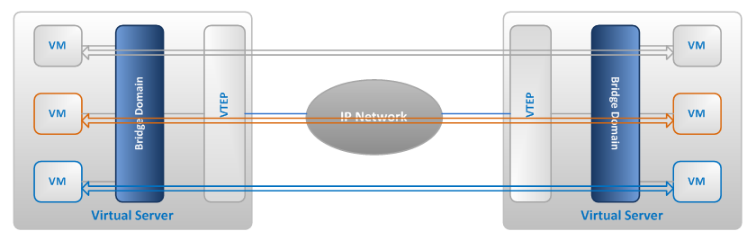
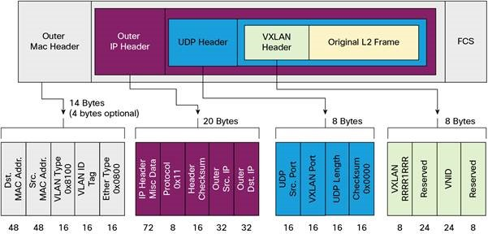
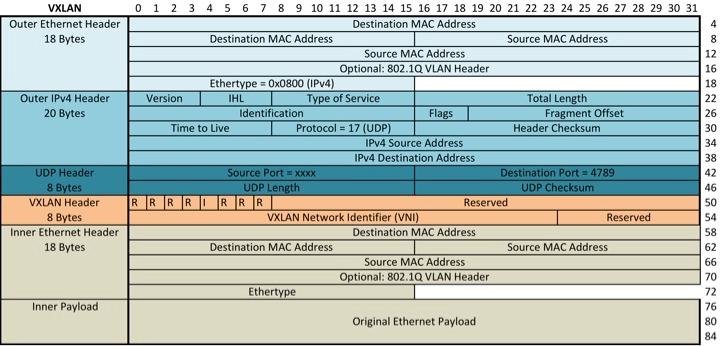
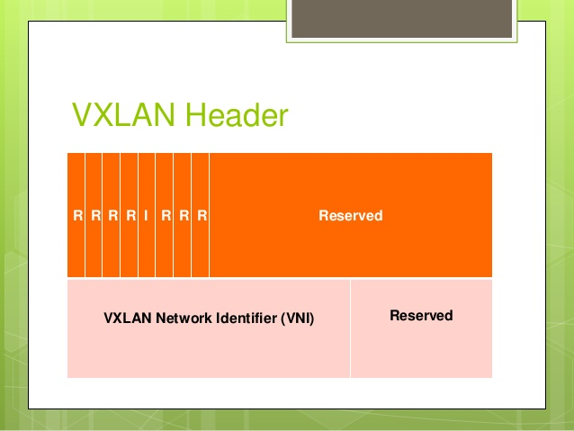
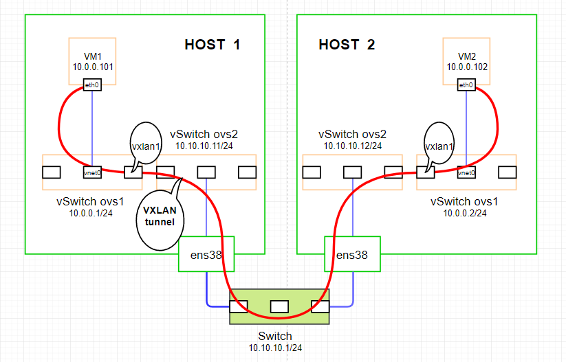
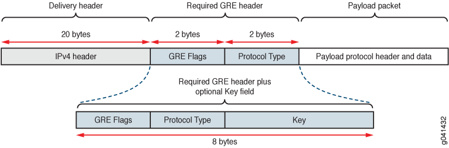
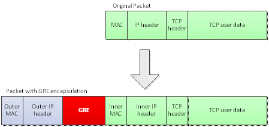
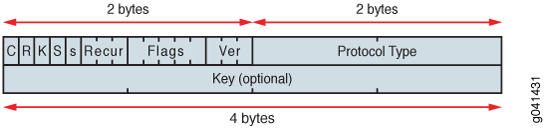
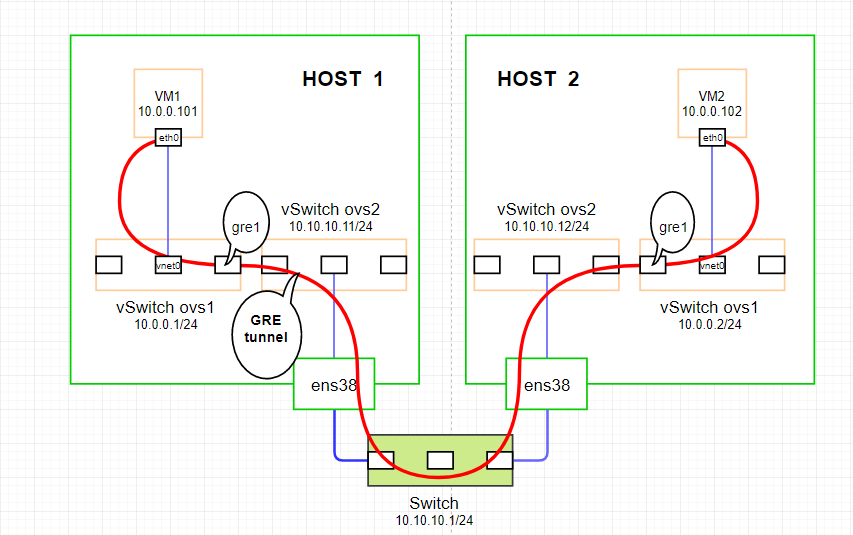

# MỤC LỤC
- [1.Giới thiệu mạng Overlay](#1)
	- [1.1.Giới thiệu VxLAN](#1.1)
	- [1.2.VXLAN Packet Format](#1.2)
		- [1.2.1.Cấu trúc gói tin VXLAN Encapsulation](#1.2.1)
		- [1.2.2 VXLAN Header](#1.2.2)
	- [1.4.LAB VXLAN với Open vSwitch](#1.3)
		- [1.4.1.Topology](#1.3.1)
		- [1.4.2.Cài đặt và cấu hình](#1.3.2)
		- [1.4.3.Kết quả](#1.3.3)
- [2.Giao thức GRE](#2)
	- [2.1.GIới thiệu](#2.1)
	- [2.2.Cấu trúc gói tin và frame của GRE](#2.2)
	- [2.3.LAB GRE](#2.3)
		- [2.3.1.Topology](#2.3.1)
		- [2.3.2.Cài đặt và cấu hình](#2.3.2)
		- [2.3.3.Kết quả](#2.3.3)


# 1\. Giới thiệu mạng Overlay
- Overlay Network là công nghệ cho phép tạo các mạng ảo trên hạ tầng mạng vật lý bên dưới (underlay network) 
- Cụ thể hơn, với overlay network, ta có thể tạo ra các mạng ảo L2 trên nền hạ tầng mạng L3 network. Đứng ở góc độ cloud computing, các mạng L2 này là mạng riêng biệt của khách hàng, với môi trường có số lượng endpoint lớn. 
VD: Như trong Docker cần có có mạng Overlay dùng khi triển khai Docker Swarm Cluster để tạo kết nối cho các Container nằm trên các Host Docker Machine khác nhau.

## 1.1. Giới thiệu VxLAN
- VxLAN (**Virtual extensible Local Area Network**) là một công nghệ tiêu chuẩn đùng để triển khai mang Overlay. Nó được thiết kế để giải quyết các vấn đề liên quan đến việc triển khai scale network.
- VxLAN mở rộng layer 3 segment rên layer3 network. VxLAN đóng gói layer2 Ethernet framé bên trong 1 VXLAN Packet bao gồm cả địa chỉ IP.
- VxLan segment được định nghĩa bằng 24 bit VNID (VxLAN IDentification) cho phép mở rộng lên tới 16 triệu segment so với 12 bit của VLANID
- VXLAN vs VLAN:
	- Cả 2 đều giống nhau với việc đóng gói các frame ở layer 2 và tạo những segments network.
	- VLAN sử dụng tà trên frame layer 2 cho việc đóng gói nên hỗ trợ khoảng 4095 	VLANs.
	- VXLAN đóng gói MAC trong UDP hỗ trợ nhiều Vxlan segment hơn lên tới 16 triệu.
- VXLAN Tunnel End Point (VTEP) dùng để kết nối switch (hiện tại là virtual switch) đến mạng IP. VTEP nằm trong hypervisor chứa VMs. Chức năng của VTEP là đóng gói VM traffic trong IP header để gửi qua mạng IP.


## 1.2 VXLAN Packet Format
- Ngoài IP header và VXLAN header, VTEP cũng chèn thêm UDP header. Trong ECMP, switch/router bao gồm UDP header để thực hiện chức năng băm. VTEP tính source port bằng cách thực hiện băm inner Ethernet frame của header. Destination UDP port là VXLAN port.
- Outer IP header chứa địa chỉ Source IP của VTEP thực hiện việc encapsulation. Địa chỉ IP đích là địa chỉ IP remote VTEP hoặc địa chỉ IP Multicast group. VXLAN đôi khi còn được gọi là công nghệ MAC-in-IP-encapsulation.
- VXLAN thêm 50 bytes. Để tránh phân mảnh và tái lắp ráp, tất cả các thiết bị mạng vật lý vẫn chuyển lưu lượng VXLAN phải chứa được gói tin này. Vì vậy, MTU cũng nên được điều chỉnh tương ứng.


## 1.2.1.Cấu trúc gói tin VXLAN Encapsulation
- Ngoài IP header và VXLAN header, VTEP cũng chèn thêm UDP header. Trong ECMP, switch/router bao gồm UDP header để thực hiện chức năng băm. VTEP tính source port bằng cách thực hiện băm inner Ethernet frame của header. Destination UDP port là VXLAN port.
- Outer IP header chứa địa chỉ Source IP của VTEP thực hiện việc encapsulation. Địa chỉ IP đích là địa chỉ IP remote VTEP hoặc địa chỉ IP Multicast group. VXLAN đôi khi còn được gọi là công nghệ MAC-in-IP-encapsulation.
- VXLAN thêm 50 bytes. Để tránh phân mảnh và tái lắp ráp, tất cả các thiết bị mạng vật lý vẫn chuyển lưu lượng VXLAN phải chứa được gói tin này. Vì vậy, MTU cũng nên được điều chỉnh tương ứng.






### 1.2.2 VXLAN Header
- VXLAN header có 8 byte. Sau đây là cấu trúc cảu VXLAN header:



## 1.3.LAB VXLAN với Open vSwitch

### 1.3.1.Topology



### 1.3.2.Cài đặt và cấu hình
#### Host 01

- Create 02 vSwitch ovs1 và ovs2
```
root@virsh01:~# ovs-vsctl add-br ovs1
root@virsh01:~# ovs-vsctl add-br ovs2
root@virsh01:~# ip link set dev ovs1 up
root@virsh01:~# ip link set dev ovs2 up
```
- Add Uplink to vswitch 
```
root@virsh01:~# ovs-vsctl add-port ovs2 ens38
root@virsh01:~# ifconfig ens38 0
root@virsh01:~# dhclient ovs2
```
- Assign IP ovs switch 1
```
root@virsh01:~# ip a add 10.0.0.1/24 dev ovs1
```
- Config VXLAN tunnel cho switcvh ovs1 giua 2 VM
```
root@virsh01:~# ovs-vsctl add-port ovs1 vxlan1 -- set interface vxlan1 type=vxlan option:remote_ip=10.10.10.130
root@virsh01:~# ovs-vsctl show
01e4e173-8975-4994-a442-f9eabf139005
    Bridge "ovs1"
        Port "vxlan1"
            Interface "vxlan1"
                type: vxlan
                options: {remote_ip="10.10.10.130"}
        Port "ovs1"
            Interface "ovs1"
                type: internal
    Bridge "ovs2"
        Port "ens38"
            Interface "ens38"
        Port "ovs2"
            Interface "ovs2"
                type: internal
    ovs_version: "2.5.9"
```
- Create network cho kvm
```
root@virsh01:~# cat network-ovs1.xml
<network>
  <name>network-ovs1</name>
  <forward mode='bridge'/>
  <bridge name='ovs1'/>
  <virtualport type='openvswitch' />
</network>
root@virsh01:~# virsh net-define network-ovs1.xml 
Network network-ovs1 defined from network-ovs1.xml
root@virsh01:~# virsh net-start network-ovs1 
Network network-ovs1 started
root@virsh01:~# virsh net-autostart network-ovs1 
Network network-ovs1 marked as autostarted
```
- Check network
```
root@virsh01:~# virsh net-list --all
setlocale: No such file or directory
 Name                 State      Autostart     Persistent
----------------------------------------------------------
 default              active     yes           yes
 network-ovs1         active     yes           yes
```
- Create VM connect to ovs1 vSwitch
```
virt-install \
--virt-type=kvm \
--os-type=Linux \
--name centos7 \
--ram 1024 \
--vcpus=1 \
--os-variant=centos7.0 \
--hvm \
--extra-args "console=ttyS0" \
--location=/var/lib/libvirt/boot/CentOS-7-x86_64-Minimal-2009.iso \
--network=bridge=ovs1,model=virtio,virtualport_type=openvswitch \
--disk path=/var/lib/libvirt/images/centos7.qcow2,size=10,bus=virtio,format=qcow2
```
#### Host 02

- Create 02 vSwitch ovs1 và ovs2
```
root@virsh02:~# ovs-vsctl add-br ovs1
root@virsh02:~# ovs-vsctl add-br ovs2
root@virsh02:~# ip link set dev ovs1 up
root@virsh02:~# ip link set dev ovs2 up
```
- Add Uplink to vswitch 
```
root@virsh02:~# ovs-vsctl add-port ovs2 ens38
root@virsh02:~# ifconfig ens38 0
root@virsh02:~# dhclient ovs2
```
- Assign IP ovs switch 1
```
root@virsh02:~# ip a add 10.0.0.2/24 dev ovs1
```
- Config VXLAN tunnel cho switcvh ovs1 giua 2 VM (Với gre chỉnh type=gre)
```
root@virsh02:~# ovs-vsctl add-port ovs1 vxlan1 -- set interface vxlan1 type=vxlan option:remote_ip=10.10.10.129
root@virsh02:~# ovs-vsctl show
255a18c6-eedc-4321-b497-2af2b95950ef
    Bridge "ovs1"
        Port "vxlan1"
            Interface "vxlan1"
                type: vxlan
                options: {remote_ip="10.10.10.129"}
        Port "vnet0"
            Interface "vnet0"
        Port "ovs1"
            Interface "ovs1"
                type: internal
    Bridge "ovs2"
        Port "ovs2"
            Interface "ovs2"
                type: internal
        Port "ens38"
            Interface "ens38"
    ovs_version: "2.5.9"
```
- Create network cho kvm
```
root@virsh01:~# cat network-ovs1.xml
<network>
  <name>network-ovs1</name>
  <forward mode='bridge'/>
  <bridge name='ovs1'/>
  <virtualport type='openvswitch' />
</network>
root@virsh01:~# virsh net-define network-ovs1.xml 
Network network-ovs1 defined from network-ovs1.xml
root@virsh01:~# virsh net-start network-ovs1 
Network network-ovs1 started
root@virsh01:~# virsh net-autostart network-ovs1 
Network network-ovs1 marked as autostarted
```
- Check network
```
root@virsh01:~# virsh net-list --all
setlocale: No such file or directory
 Name                 State      Autostart     Persistent
----------------------------------------------------------
 default              active     yes           yes
 network-ovs1         active     yes           yes
```
- Create VM connect to vSwitch ovs1
```
virt-install \
--virt-type=kvm \
--os-type=Linux \
--name centos7 \
--ram 1024 \
--vcpus=1 \
--os-variant=centos7.0 \
--hvm \
--extra-args "console=ttyS0" \
--location=/var/lib/libvirt/boot/CentOS-7-x86_64-Minimal-2009.iso \
--network=bridge=ovs1,model=virtio,virtualport_type=openvswitch \
--disk path=/var/lib/libvirt/images/centos7.qcow2,size=10,bus=virtio,format=qcow2
```
### 1.3.3. Kết quả
**a, VM Host 01**
```
[root@localhost ~]# ip a                                                       
1: lo: <LOOPBACK,UP,LOWER_UP> mtu 65536 qdisc noqueue state UNKNOWN group default qlen 1000
    link/loopback 00:00:00:00:00:00 brd 00:00:00:00:00:00
    inet 127.0.0.1/8 scope host lo
       valid_lft forever preferred_lft forever
    inet6 ::1/128 scope host 
       valid_lft forever preferred_lft forever
2: eth0: <BROADCAST,MULTICAST,UP,LOWER_UP> mtu 1500 qdisc pfifo_fast state UP group default qlen 1000
    link/ether 52:54:00:04:74:ea brd ff:ff:ff:ff:ff:ff
    inet 10.0.0.101/24 brd 10.0.0.255 scope global noprefixroute eth0
       valid_lft forever preferred_lft forever
    inet6 fe80::d767:570a:edcf:2aac/64 scope link noprefixroute 
       valid_lft forever preferred_lft forever
[root@localhost ~]# ping 10.0.0.102
PING 10.0.0.102 (10.0.0.102) 56(84) bytes of data.
64 bytes from 10.0.0.102: icmp_seq=1 ttl=64 time=1.44 ms
64 bytes from 10.0.0.102: icmp_seq=2 ttl=64 time=2.04 ms

--- 10.0.0.102 ping statistics ---
2 packets transmitted, 2 received, 0% packet loss, time 1001ms
rtt min/avg/max/mdev = 1.448/1.745/2.042/0.297 ms 
[root@localhost ~]# ip a                                                       
1: lo: <LOOPBACK,UP,LOWER_UP> mtu 65536 qdisc noqueue state UNKNOWN group default qlen 1000
    link/loopback 00:00:00:00:00:00 brd 00:00:00:00:00:00
    inet 127.0.0.1/8 scope host lo
       valid_lft forever preferred_lft forever
    inet6 ::1/128 scope host 
       valid_lft forever preferred_lft forever
2: eth0: <BROADCAST,MULTICAST,UP,LOWER_UP> mtu 1500 qdisc pfifo_fast state UP group default qlen 1000
    link/ether 52:54:00:04:74:ea brd ff:ff:ff:ff:ff:ff
    inet 10.0.0.101/24 brd 10.0.0.255 scope global noprefixroute eth0
       valid_lft forever preferred_lft forever
    inet6 fe80::d767:570a:edcf:2aac/64 scope link noprefixroute 
       valid_lft forever preferred_lft forever
[root@localhost ~]# ping 10.0.0.102
PING 10.0.0.102 (10.0.0.102) 56(84) bytes of data.
64 bytes from 10.0.0.102: icmp_seq=1 ttl=64 time=1.44 ms
64 bytes from 10.0.0.102: icmp_seq=2 ttl=64 time=2.04 ms

--- 10.0.0.102 ping statistics ---
2 packets transmitted, 2 received, 0% packet loss, time 1001ms
rtt min/avg/max/mdev = 1.448/1.745/2.042/0.297 ms	 
```
**b, VM Host 02**
```
[root@localhost ~]# ip a
1: lo: <LOOPBACK,UP,LOWER_UP> mtu 65536 qdisc noqueue state UNKNOWN group default qlen 1000
    link/loopback 00:00:00:00:00:00 brd 00:00:00:00:00:00
    inet 127.0.0.1/8 scope host lo
       valid_lft forever preferred_lft forever
    inet6 ::1/128 scope host 
       valid_lft forever preferred_lft forever
2: eth0: <BROADCAST,MULTICAST,UP,LOWER_UP> mtu 1500 qdisc pfifo_fast state UP group default qlen 1000
    link/ether 52:54:00:bc:bf:6e brd ff:ff:ff:ff:ff:ff
    inet 10.0.0.102/24 brd 10.0.0.255 scope global noprefixroute eth0
       valid_lft forever preferred_lft forever
    inet6 fe80::2bf6:67b:9f9d:a290/64 scope link noprefixroute 
       valid_lft forever preferred_lft forever
[root@localhost ~]# ping 10.0.0.101
PING 10.0.0.101 (10.0.0.101) 56(84) bytes of data.
64 bytes from 10.0.0.101: icmp_seq=1 ttl=64 time=0.722 ms
64 bytes from 10.0.0.101: icmp_seq=2 ttl=64 time=2.44 ms
64 bytes from 10.0.0.101: icmp_seq=3 ttl=64 time=2.42 ms
64 bytes from 10.0.0.101: icmp_seq=4 ttl=64 time=2.19 ms
64 bytes from 10.0.0.101: icmp_seq=5 ttl=64 time=2.46 ms
```

## 2.1. Giới thiệu GRE
- GRE là giao thức tunneling point-to-point, trong đó inner frame được đóng gói GRE theo tài liệu RFC 2784 và RFC 2890. Trong đó trường Key (chiếm 4 octects tương đương 32 bits) trong GRE header sử dụng để mang Tenant Network Identifier (TNI - định danh mạng khách hàng) và được sử dụng để cô lập các logical segment khác nhau.
- GRE đóng gói inner frame sử dụng IP protocol số 47 để truyền thông chứ không sử dụng TCP hay UDP
## 2.2.Cấu trúc gói tin và frame của GRE

- Gói tin GRE có thể thêm 24B hoặc  28B với header plus.

- Cấu trúc frame của GRE:

- GRE Header Format


## 2.3.LAB GRE 

### 2.3.1.Topology



### 2.3.2.Cài đặt và cấu hình
#### Host 01

**- Create 02 vSwitch ovs1 và ovs2**
```
root@virsh01:~# ovs-vsctl add-br ovs1
root@virsh01:~# ovs-vsctl add-br ovs2
root@virsh01:~# ip link set dev ovs1 up
root@virsh01:~# ip link set dev ovs2 up
```
**- Add Uplink to vswitch** 
```
root@virsh01:~# ovs-vsctl add-port ovs2 ens38
root@virsh01:~# ifconfig ens38 0
root@virsh01:~# dhclient ovs2
```
**- Assign IP ovs switch 1**
```
root@virsh01:~# ip a add 10.0.0.1/24 dev ovs1
```
**- Config VXLAN tunnel cho switcvh ovs1 giua 2 VM**
```
root@virsh01:~# ovs-vsctl add-port ovs1 gre1 -- set interface gre1 type=gre option:remote_ip=10.10.10.130"
```
**- Create network cho kvm**
```
root@virsh01:~# cat network-ovs1.xml
<network>
  <name>network-ovs1</name>
  <forward mode='bridge'/>
  <bridge name='ovs1'/>
  <virtualport type='openvswitch' />
</network>
root@virsh01:~# virsh net-define network-ovs1.xml 
Network network-ovs1 defined from network-ovs1.xml
root@virsh01:~# virsh net-start network-ovs1 
Network network-ovs1 started
root@virsh01:~# virsh net-autostart network-ovs1 
Network network-ovs1 marked as autostarted
```
**- Check network**
```
root@virsh01:~# virsh net-list --all
setlocale: No such file or directory
 Name                 State      Autostart     Persistent
----------------------------------------------------------
 default              active     yes           yes
 network-ovs1         active     yes           yes
```
**- Create VM connect to ovs1 vSwitch**
```
virt-install \
--virt-type=kvm \
--os-type=Linux \
--name centos7 \
--ram 1024 \
--vcpus=1 \
--os-variant=centos7.0 \
--hvm \
--extra-args "console=ttyS0" \
--location=/var/lib/libvirt/boot/CentOS-7-x86_64-Minimal-2009.iso \
--network=bridge=ovs1,model=virtio,virtualport_type=openvswitch \
--disk path=/var/lib/libvirt/images/centos7.qcow2,size=10,bus=virtio,format=qcow2
```
#### Host 02
**- Create 02 vSwitch ovs1 và ovs2**
```
root@virsh02:~# ovs-vsctl add-br ovs1
root@virsh02:~# ovs-vsctl add-br ovs2
root@virsh02:~# ip link set dev ovs1 up
root@virsh02:~# ip link set dev ovs2 up
```
**- Add Uplink to vswitch** 
```
root@virsh02:~# ovs-vsctl add-port ovs2 ens38
root@virsh02:~# ifconfig ens38 0
root@virsh02:~# dhclient ovs2
```
**- Assign IP ovs switch 1**
```
root@virsh02:~# ip a add 10.0.0.2/24 dev ovs1
```
**- Config VXLAN tunnel cho switcvh ovs1 giua 2 VM (Với gre chỉnh type=gre)**
```
root@virsh02:~# ovs-vsctl add-port ovs1 gre1 -- set interface gre1 type=gre option:remote_ip=10.10.10.129"
```
**- Create network cho kvm**
```
root@virsh01:~# cat network-ovs1.xml
<network>
  <name>network-ovs1</name>
  <forward mode='bridge'/>
  <bridge name='ovs1'/>
  <virtualport type='openvswitch' />
</network>
root@virsh01:~# virsh net-define network-ovs1.xml 
Network network-ovs1 defined from network-ovs1.xml
root@virsh01:~# virsh net-start network-ovs1 
Network network-ovs1 started
root@virsh01:~# virsh net-autostart network-ovs1 
Network network-ovs1 marked as autostarted
```
**- Check network**
```
root@virsh01:~# virsh net-list --all
setlocale: No such file or directory
 Name                 State      Autostart     Persistent
----------------------------------------------------------
 default              active     yes           yes
 network-ovs1         active     yes           yes
```
**- Create VM connect to vSwitch ovs1**
```
virt-install \
--virt-type=kvm \
--os-type=Linux \
--name centos7 \
--ram 1024 \
--vcpus=1 \
--os-variant=centos7.0 \
--hvm \
--extra-args "console=ttyS0" \
--location=/var/lib/libvirt/boot/CentOS-7-x86_64-Minimal-2009.iso \
--network=bridge=ovs1,model=virtio,virtualport_type=openvswitch \
--disk path=/var/lib/libvirt/images/centos7.qcow2,size=10,bus=virtio,format=qcow2
```

### 2.3.2. Kết quả
**a, VM Host 01**
```
[root@localhost ~]# ip a                                                       
1: lo: <LOOPBACK,UP,LOWER_UP> mtu 65536 qdisc noqueue state UNKNOWN group default qlen 1000
    link/loopback 00:00:00:00:00:00 brd 00:00:00:00:00:00
    inet 127.0.0.1/8 scope host lo
       valid_lft forever preferred_lft forever
    inet6 ::1/128 scope host 
       valid_lft forever preferred_lft forever
2: eth0: <BROADCAST,MULTICAST,UP,LOWER_UP> mtu 1500 qdisc pfifo_fast state UP group default qlen 1000
    link/ether 52:54:00:04:74:ea brd ff:ff:ff:ff:ff:ff
    inet 10.0.0.101/24 brd 10.0.0.255 scope global noprefixroute eth0
       valid_lft forever preferred_lft forever
    inet6 fe80::d767:570a:edcf:2aac/64 scope link noprefixroute 
       valid_lft forever preferred_lft forever
[root@localhost ~]# ping 10.0.0.102
PING 10.0.0.102 (10.0.0.102) 56(84) bytes of data.
64 bytes from 10.0.0.102: icmp_seq=1 ttl=64 time=1.44 ms
64 bytes from 10.0.0.102: icmp_seq=2 ttl=64 time=2.04 ms

--- 10.0.0.102 ping statistics ---
2 packets transmitted, 2 received, 0% packet loss, time 1001ms
rtt min/avg/max/mdev = 1.448/1.745/2.042/0.297 ms 
[root@localhost ~]# ip a                                                       
1: lo: <LOOPBACK,UP,LOWER_UP> mtu 65536 qdisc noqueue state UNKNOWN group default qlen 1000
    link/loopback 00:00:00:00:00:00 brd 00:00:00:00:00:00
    inet 127.0.0.1/8 scope host lo
       valid_lft forever preferred_lft forever
    inet6 ::1/128 scope host 
       valid_lft forever preferred_lft forever
2: eth0: <BROADCAST,MULTICAST,UP,LOWER_UP> mtu 1500 qdisc pfifo_fast state UP group default qlen 1000
    link/ether 52:54:00:04:74:ea brd ff:ff:ff:ff:ff:ff
    inet 10.0.0.101/24 brd 10.0.0.255 scope global noprefixroute eth0
       valid_lft forever preferred_lft forever
    inet6 fe80::d767:570a:edcf:2aac/64 scope link noprefixroute 
       valid_lft forever preferred_lft forever
[root@localhost ~]# ping 10.0.0.102
PING 10.0.0.102 (10.0.0.102) 56(84) bytes of data.
64 bytes from 10.0.0.102: icmp_seq=1 ttl=64 time=1.44 ms
64 bytes from 10.0.0.102: icmp_seq=2 ttl=64 time=2.04 ms

--- 10.0.0.102 ping statistics ---
2 packets transmitted, 2 received, 0% packet loss, time 1001ms
rtt min/avg/max/mdev = 1.448/1.745/2.042/0.297 ms	 
```
**b, VM Host 02**
```
[root@localhost ~]# ip a
1: lo: <LOOPBACK,UP,LOWER_UP> mtu 65536 qdisc noqueue state UNKNOWN group default qlen 1000
    link/loopback 00:00:00:00:00:00 brd 00:00:00:00:00:00
    inet 127.0.0.1/8 scope host lo
       valid_lft forever preferred_lft forever
    inet6 ::1/128 scope host 
       valid_lft forever preferred_lft forever
2: eth0: <BROADCAST,MULTICAST,UP,LOWER_UP> mtu 1500 qdisc pfifo_fast state UP group default qlen 1000
    link/ether 52:54:00:bc:bf:6e brd ff:ff:ff:ff:ff:ff
    inet 10.0.0.102/24 brd 10.0.0.255 scope global noprefixroute eth0
       valid_lft forever preferred_lft forever
    inet6 fe80::2bf6:67b:9f9d:a290/64 scope link noprefixroute 
       valid_lft forever preferred_lft forever
[root@localhost ~]# ping 10.0.0.101
PING 10.0.0.101 (10.0.0.101) 56(84) bytes of data.
64 bytes from 10.0.0.101: icmp_seq=1 ttl=64 time=0.722 ms
64 bytes from 10.0.0.101: icmp_seq=2 ttl=64 time=2.44 ms
64 bytes from 10.0.0.101: icmp_seq=3 ttl=64 time=2.42 ms
64 bytes from 10.0.0.101: icmp_seq=4 ttl=64 time=2.19 ms
64 bytes from 10.0.0.101: icmp_seq=5 ttl=64 time=2.46 ms
```
